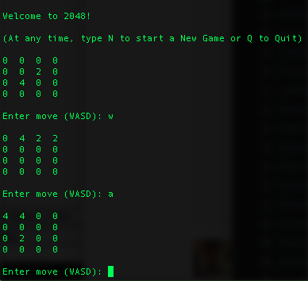
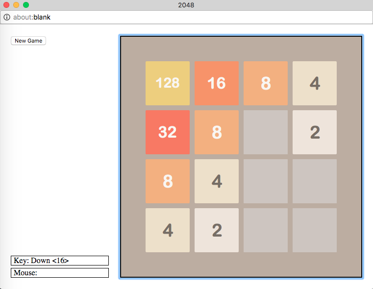
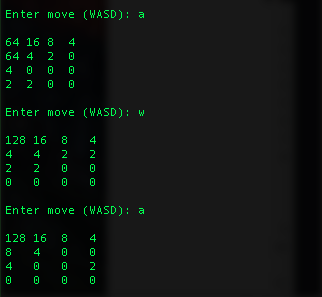
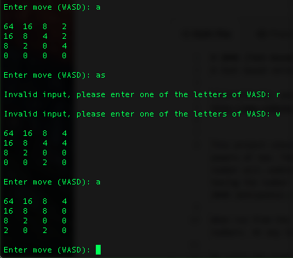
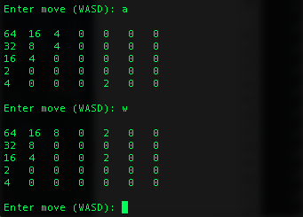
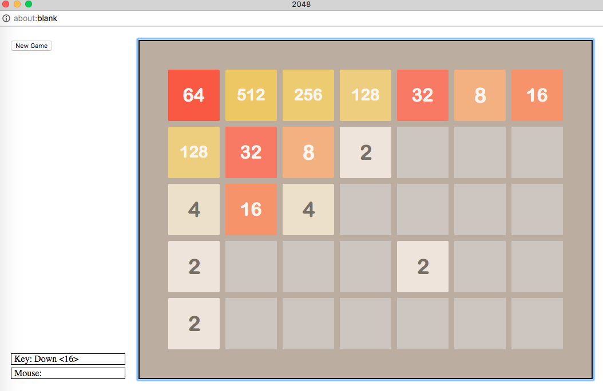

# 2048 (Text-based)
A text-based version of 2048 that can be played from the shell

Alternatively, you can play a GUI-version via the following CodeSkulptor link:
http://www.codeskulptor.org/#user42_MV18rCJXKxCoHVl.py

This project simulates the popular puzzle game, 2048. Traditionally, the game involves a 4x4 grid with blocks having numbers that are powers of two. On each turn, the player inputs a cardinal direction towards which all will slide. Pairs of blocks sharing the same number will combine to form a single block having the sum of its two parents (hence the powers of two). The goal is to create a block having the number 2048 (or as large a number as possible). <a href="https://en.wikipedia.org/wiki/2048_(video_game)">Find out more about 2048 (Wikipedia)</a>

When run from the shell, the player may use the WASD keys to indicate up, left, down, and right. The board is represented as a 4x4 grid of numbers. At any time, the player may type 'N' to start a new game or 'Q' to quit. All commands are case-insensitive.

By using the CodeSkulptor link above, the player may also play the same implementation of the game but with a GUI interface.

# Additional features:

In the text-based version, the grid spacing will adjust according to the size of the largest number.

In the text-based version, invalid inputs are handled such that game state is maintained until valid input is entered.

The class generating the board will accept any arbitrary board size.

Text-based

GUI version

